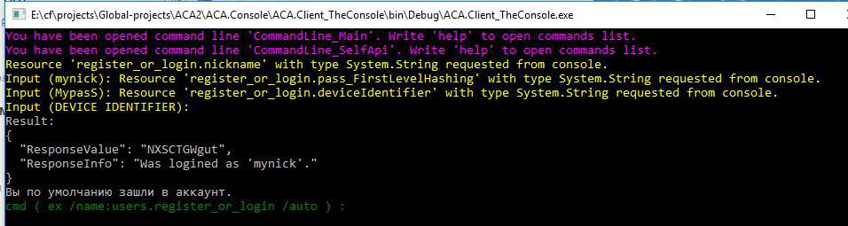

#  RollingOutTools - all my coolest libraries
 Here you can see solution with may libraries that i use in own projects.
 This assemblies is unified and i can make it opensource.
 All assemblies here: https://www.nuget.org/profiles/KogerCoder
 
 Why "rolling out tools"? Its name of my team, where we share expirience and just communicate.
 

 
 Some info about projects:
 * `CmdLine` - one of my best sources, this utility make CLI development much easier. 
It can automatically build CLI from classes, automatically read/write ANY type from console (using serialization for difficult objects), cache values for each called command (and you can run it like simple autotest by pressing enter) and more.
 * `ReflectionVisit` - utility to call methods from classes by its names, with reflection caching, awaiting async methods and getting its values (note, that it is difficult, because you dont know type of returning value). Can be used for building CLI too or, for examle, own web framework.
 * `PureApi.AspNetCore.Json` - cool lib, that extend asp.net web api models resolving. Just use [FromPureApi] attribute in controller method params like you always do it with [FromBody] attribute and etc. But this utility allow to use more than one parameters, when you sending it through http method body in json. This lib add no limitations to standart asp.net controllers, because os use its request pipeline. 
 * `Storage` - simple generic key/value storage. Platform dependencies can be injected.
 * `Json` - just wrapper on Newtonsoft.Json with some extensions.
 * `SimpleIoc` - wrapper on ioc container. Now use only Autofac. I make it, because i need support of Bridge.NET, where Autofac doesnt work.
 `copy_to_nuget_dir.cmd` - just macros, that copy nuget packages to my local nuget folder.
 

 To know more, you can read my workflow telegram channel https://t.me/coding_workflow
 
 Contacts:
 &nbsp;&nbsp;&nbsp;&nbsp;Vk - https://vk.com/yura_mysko
 &nbsp;&nbsp;&nbsp;&nbsp;Youtube - https://www.youtube.com/channel/UCiIj3Q0z1pNJ2KyNRcspoZw
 &nbsp;&nbsp;&nbsp;&nbsp;Habrahabr blog - https://habrahabr.ru/users/kogercoder/
 &nbsp;&nbsp;&nbsp;&nbsp;Telegram - https://t.me/yura_mysko